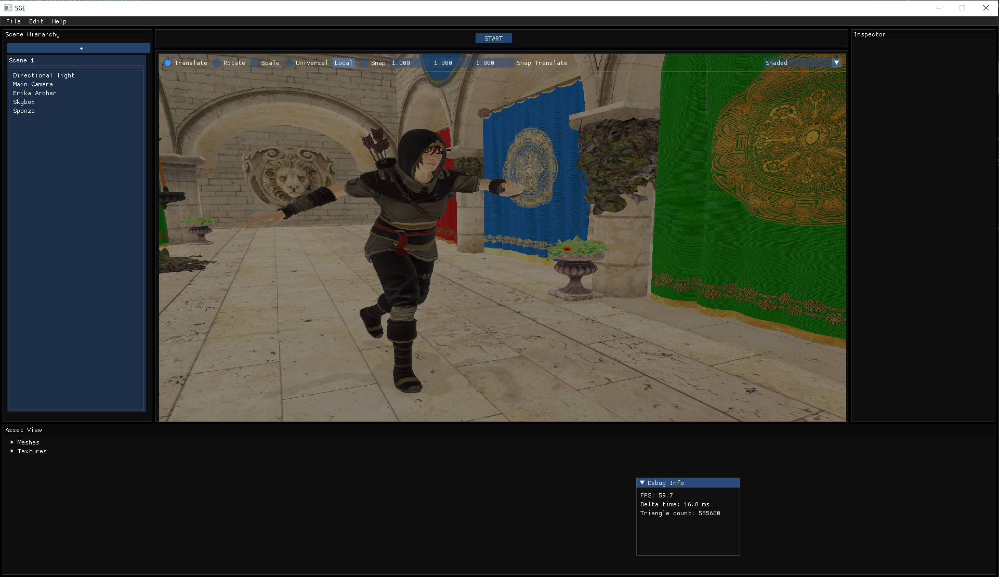
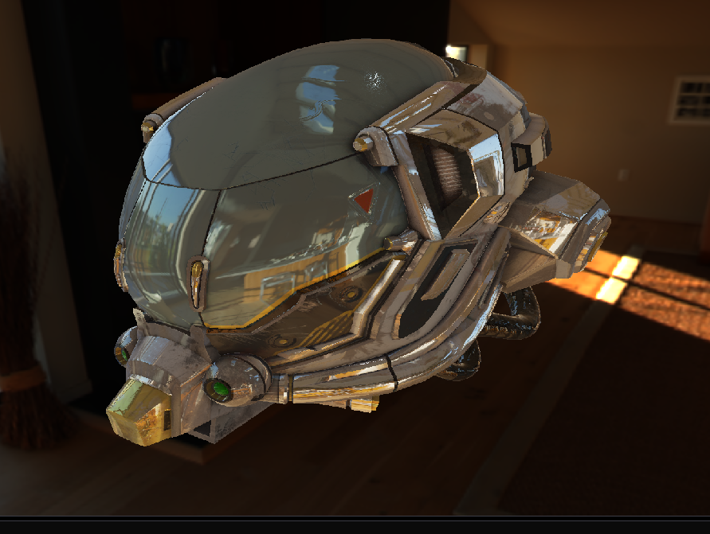
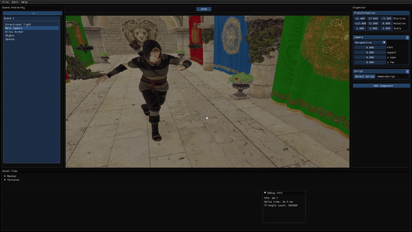

# SGE - Simple Game Engine

Welcome to **SGE (Simple Game Engine)**, a lightweight and easy-to-use game engine designed for developers who want to focus on creating 3D games. SGE provides the essential tools to get your game up and running while remaining highly customizable.

---

## 🚀 Features

- **Physically Based Rendering (PBR):** Achieve stunning visual fidelity.
- **Entity Component System (ECS):** Flexible and modular game object management.
- **Customizable Shaders:** Tailor the look and feel of your game.
- **Animation Support:** Seamlessly integrate animated assets.
- **User-Friendly Editor:** Powered by ImGui for quick scene creation and debugging.
- **Physics Integration:** Built with PhysX for realistic physics simulations.
- **Cross-Platform:** Develop and deploy on multiple platforms with ease.

---

## 📸 Screenshots







---

## 🛠️ Getting Started

### Cloning the Repository

```bash
git clone https://github.com/StavFaran92/Simple-Graphics-Engine.git
```

### Building the Engine

1. Navigate to the repo folder and enter 

```bash
mkdir build & cd build & cmake --build ..
```

2. You can now build your project using however you like

---

## 📖 Documentation

TBD

---

## 🤝 Contributing

Contributions are welcome! If you'd like to help improve SGE, please:

1. Fork the repository.
2. Create a new branch for your feature/bug fix.
3. Submit a pull request with detailed explanations of your changes.

---

## 📄 License

This project is licensed under the MIT License. See the `LICENSE` file for details.

---

## 💬 Contact

For questions or support, reach out via:
- Email: faran.stav@gmail.com
---

Enjoy creating games with **SGE**! 🎮
